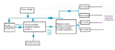

IMPLEMENTATION OF A CHEAP MECHANICAL ARM USING A LINEAR ACTUATOR 

By: Adrivid Mishra 

Bachelors in Technology (Computer Science engineering) (Internet of Things) 

VIT Vellore, Tamil Nadu 

*ABSTRACT: - In this paper, we present a low-cost, DIY mechanical arm designed to assist with everyday tasks and lightweight lifting. It is built using affordable components like PVC pipes, DC and servo motors, a linear actuator, and an Arduino controller, the arm is also equipped with an MPU- 6050 sensor for motion detection and balance. Despite its simple construction, the arm is capable of lifting up to 350 grams—three times more than a similar design in previous research. It costs nearly half as much (around $50 compared to $100) compared to the previous design. This project explores how accessible robotics can be used to support individuals with limited mobility in performing routine activities, such as reaching or lifting small items. It is a perfect balance of affordability, strength and precision. It has the potential to create a huge impact due to it's real world usage*

**INTRODUCTION**

This  project  introduces  the  design  and  implementation  of  a gesture-controlled,  low-cost  robotic arm  that operates using  a wired glove interface. 

The mechanical arm structure is constructed from PVC pipes, which is cheap, sturdy and light weight. The vertical (up and down) movement of the arm is made possible through a DC motor coupled with a linear actuator. Two servo motors drive the elbow joint  and  claw  mechanism,  respectively,  to  provide  smooth movement and stable gripping. 

The major innovation is the wired glove as the control interface. The glove is mounted with an MPU6050 inertial measurement unit (IMU) and a rotary potentiometer. The MPU6050 delivers 3- axis gyroscope and accelerometer data, enabling the system to monitor hand orientation and hand movement in real-time . These movements are translated directly to the joint positions of the robotic arm. The potentiometer provides another analog input channel, allowing for manual control of certain functions, for instance, movement of the claw or placement of the elbow, based on how it is configured. 

The system is powered and controlled by an Arduino Uno, which interprets the sensor data and provides control signals. An L298N motor driver provides power delivery and direction control for the DC motor and linear actuator. Servo motors are powered using PWM  outputs  controlled  by  the  microcontroller  Arduino. Calibration procedures are applied to the MPU6050 to minimize sensor drift and enhance movement precision, which is essential 

for precise tasks such as manipulation of small robotic medical devices. 

By integrating a gesture-sensing wired glove with a basic yet efficient  mechanical  arm,  the  project  presents  an  economical solution  for  patient  care,  rehabilitation,  and  low-cost  robotic education  applications.  With  basic  electronics  and  smart calibration, the system proves that it is possible to achieve high- precision gesture control without the use of costly or wireless devices. 

The main contributions of this work are as follows: 

• The creation and build of a low-cost mechanical arm from easily available components like PVC pipes, servo motors, a DC motor, and a linear actuator that cost around $50 for the entire build, much  cheaper  than  the  $100  threshold  described  in  previous work. 

•The  creation  of  a  hybrid  actuation  mechanism,  where  a  DC motor is used together with a linear actuator for vertical motion and two servo motors for elbow motion and gripper operation. 

•An improved performance in lifting ability, as the target arm is able to lift up to 400 grams, twice the lifting ability of the system referred to, and sustain mechanical stability and convenience of control. 

•Incorporation of the MPU-6050 motion sensor to facilitate real- time  feedback,  providing  a  basis  for  future  enhancements  in gesture-based or stability-controlled operation. 

•Illustration  of  possible  applications  in  assistive  and  medical domains,  specifically  in  helping  individuals  with  reduced mobility to accomplish simple object manipulation tasks. 

•A reproducible and modular design applicable for educational purposes in introductory robotics, embedded systems, and low- cost prototyping contexts 

**LITERATURE RIVEW**

Several  studies have explored gesture-controlled  robotic  arms using various sensor and communication technologies. Cheren et al. [6] proposed a design using flex sensors and ZigBee for remote operation,  focusing  on  hazardous  environments  but  facing limitations in motion accuracy. Jiang et al. introduced a dual- accelerometer  system  for  full-axis  control,  though  the  added hardware increased complexity and cost. 

Varghese et al. [7] implemented a wireless, microcontroller-based robotic arm for lightweight tasks, while Saleheen et al. [8] used the MPU6050 sensor but encountered challenges with calibration and precision. Duraisamy et al. [11] further highlighted common issues  in  glove-based  control  systems,  especially  inconsistent sensor data. 

While  these  works  demonstrated  functional gesture-controlled arms,  they  were  often  constrained  by  high  cost,  limited  load capacity, or lack of real-time feedback. In contrast, the present work offers a simplified, cost-effective solution capable of lifting up  to  400  grams,  using  calibrated  sensor  input  for  improved precision—making it more practical for assistive and medical applications. 

**PROBLEM STATEMENT** 

Robotic  arms  have  the  potential  to  significantly  improve  the quality of life for individuals who are physically challenged and it can also support healthcare professionals in tasks requiring precision  and  safety.  However,  most  existing  robotic  arms designed for medical applications suffer from one or more of the following  limitations:  high  cost,  lack  of  precision,  complex control systems, or poor accessibility in low-resource settings. 

Moreover,  many  gesture-controlled  robotic  systems  rely  on wireless  communication  and  expensive  hardware,  which increases the system's complexity and also the overall cost. These constraints  hinder  their  widespread  use  in  home-based  care, rehabilitation environments, and educational setups. 

To address these challenges, this study proposes the development of a low-cost, gesture-controlled robotic arm operated using a wired  glove  interface  using  an  MPU6050  sensor  and potentiometer. The system aims to provide an affordable, stable, and  precise  control  mechanism  for  object  manipulation, particularly  in  medical  and  assistive  contexts,  such  as  aiding patients  with  limited  mobility  or  handling  delicate  items like medicines. 

**METHODOLOGY and IMPLEMENTATION** 

To enhance the precision while reducing the build cost of the mechanical arm, the manufacturing is implemented with simple materials. This section describes the hardware and software used and the algorithm proposed for the arm system. 

1. ***Hardware components*** 

300  RPM  12V  DC  Metal  Gear  Motor: Used in conjunction with the linear actuator mechanism to enable robust vertical movement of the robotic arm. The high torque output makes it suitable for lifting applications. 

150  RPM  BO  Motor  with  Wheel  (Single  Shaft): Utilized for base mobility or additional rotational support where applicable. The built-in wheel enables smooth directional control in lightweight applications. 

` `ArduinoUnoR3: 

Acts as the main microcontroller, responsible for reading sensor data and generating control signals for the actuators. Programmed using the Arduino IDE. 

L298NMotorDriverModule: 

Controls the direction and speed of the DC motors. Capable of handling  high-current  loads  and  interfacing  directly  with  the Arduino. 

MPU6050SensorModule: 

A 6-axis Inertial Measurement Unit (IMU) that provides 3-axis accelerometer and 3-axis gyroscope data. Used to detect hand orientation and movement for gesture-based control 

. 

L7806VoltageRegulatorIC: 

A linear step-down voltage regulator used to provide a stable 6V output for powering servos and other components sensitive to voltage variations. 

470KΩTri-pinPotentiometer: 

Mounted on the glove to provide analog input control for specific joint or claw movements, allowing manual fine-tuning during operation. 

MG90SServoMotor(180°): 

Used for precise angular movement in smaller joints such as the gripper or wrist. Offers lightweight operation with reliable torque. 



MG996RServoMoto(360°): 

High-torque servo motor used for the elbow joint. Capable of continuous rotation and supporting greater loads. 

12V,2.33APowerAdapter: 

Serves  as  the  primary  power  supply  for  the  entire  system, including motors and control electronics. 

JumperWires: 

Used  to  connect  all  electronic  components  and  assemble  the control circuit by soldering 

2. ***Hardware implementation*** 

The hardware implementation of the proposed gesture-controlled robotic arm is centered around a soldered setup of key actuators, sensors, and input devices. The design was optimized for low cost and practical usability, with a wired glove acting as the primary user interface. 

1. Actuation System 

The mechanical movements of the robotic arm are driven by a combination of DC and servo motors: 

A 300 RPM 12V DC metal gear motor is paired with a linear actuator to handle the vertical (up and down) movement of the arm. This configuration offers sufficient torque and lift capacity for the entire arm assembly. 

A 150 RPM BO motor alongside a single-shaft wheel provides support for the base of the model to change the orientation of the model as required. 

An MG996R servo motor (360°) is attached at the elbow joint. It is used to enable rotation and precise positioning of the arm. It has a higher torque handling. 

An MG90S servo motor (180°) is mounted at the claw (gripper), one side of the claw is fixed and other side is fixed to the servo motor which does a 0 or 90° movement in order to grasp the item required 

2. Control System 

The most important part of the system is the Arduino UNO R3 , it is the main control unit of the system , it reads the sensor outputs and  generates  the  PWM  signals  to  control  the  motors  in  the mechanical arm. The LN 298N motor driver module is used to interface the DC motors ,  speed control of linear actuator and BO motor with the Arduino. 

A 12V 2.33A power adapter is used to supply power to the system. To ensure voltage compatibility with the servo motors, a L7806 voltage regulator IC steps down the voltage to a stable 6V output. 

3. Wired Glove Interface 

The robotic arm is used with a wired glove that serves as the gesture input. The glove contains the following components: 

An MPU6050 sensor module, it is used to detect the real time hand orientation. It does so by measuring the roll, pitch and yaw using the integrating 3 – axis accelerometer and gyroscope. These readings are used to control the arm’s motion in space 

The glove is connected with a 470KΩ rotary potentiometer for claw (gripper) control. At the end-effector, it supplies an analog signal that  is mapped  to the MG90S  servo  motor's open and closure angles. 

4. Electrical Assembly 

All of the parts are soldered together point-to-point using jumper wires rather than a printed circuit board. The connections were fastened  to  prevent  interference  during  movement  and strengthened for durability. The system is smaller thanks to this soldered configuration, which also reduces the possibility of wire disconnections while in use  

PVC pipes are used to construct the arm's overall construction because they provide a lightweight, inexpensive, and adaptable frame  that  is  ideal  for  testing  and  prototyping. 

***C. Software components*** 

The gesture-controlled robotic arm system's software was created to decipher sensor data, regulate motor outputs, and guarantee responsive, seamless  operation. To provide  precise  movement mapping  from  the  glove  to  the  robotic  arm,  the  system uses calibration  and  data  processing  methods  in  conjunction  with embedded programming using the Arduino platform. 

1\. The Arduino IDE  

The Arduino Integrated Development Environment (IDE) was used to program the robotic arm's entire control circuitry. For the Arduino Uno, the IDE offers a streamlined C/C++ programming interface together with pre-installed libraries necessary for servo control and sensor data collection. The following libraries are used: 

a.)For I2C communication with the MPU6050 sensor, use Wire.h. 

b.) The MG996R and MG90S servo motors are controlled by PWM signals generated by servo.h.  

The Arduino reads analog and digital input data from the MPU6050 sensor and potentiometer, processes the values, and maps them to motor angles or movement commands accordingly. 

2. Sensor Calibration and Filtering 

Raw sensor data from the MPU6050 tends to include noise and drift, which can reduce movement accuracy. To address this: 

A  manual  calibration  routine  was  implemented  during initialization  to  correct  baseline  offset  values  from  the accelerometer and gyroscope. 

Averaging filters and threshold conditions were used to eliminate random noise and ensure that only intentional, stable gestures produce motor responses. 

Sensor readings are interpreted to determine the roll, pitch, and yaw, which are then mapped to corresponding arm movements. 

3. Potentiometer Input Processing 

The 470KΩ potentiometer attached to the glove is used to control the claw (gripper). Its analog input (0–1023) is mapped to a servo angle (typically 0°–180°), allowing the user to manually adjust the claw’s open or closed position with precision. 

4. PWM Signal Generation and Actuator Control 

Using the Servo.h library, PWM signals are generated for each servo motor based on the processed input data. These signals determine the angle or position of the servo joints. The L298N motor driver is controlled through digital output pins to regulate the direction and speed of the DC motor and linear actuator, depending on the vertical movement commands. 

5. Real-time Responsiveness 

The code is written in a non-blocking structure, using loops and conditionals  to  ensure  real-time  responsiveness  to  changes  in hand orientation and potentiometer adjustments. This is critical in applications requiring precision, such as medication handling in assistive or medical contexts. 

***D. Software implementation*** 

The Arduino Uno R3 is the main processing unit used in the soft ware implementation of the gesturecontrolled robotic arm. It inte rprets sensor data and manages the actuation system.Using C/C+ + programming and libraries for managing sensor communicatio n and motor actuation, the control algorithm was created using t he Arduino Integrated Development Environment (IDE). 

The Arduino initializes all required modules, such as the potenti ometer for manual input and the MPU6050 sensor for motion de tection.While the Servo.h library enables the generation of accur ate PWM signals necessary to run the servo motors, the Wire.h li brary is needed to establish I2C communication with the MPU6 050.The MPU6050 goes through a calibration process at startup to record baseline gyroscope and accelerometer readings while t he glove is in a neutral, motionless posture.In order to compensa te for sensor drift and guarantee precise gesture interpretation, th ese baseline values are essential. 

After initialization, the software moves into its main loop, which reads analog values from the potentiometer and motion data from the MPU6050 constantly. Data from the MPU6050's three-axis accelerometer and gyroscope is processed to determine the roll, pitch,  and  yaw  angles  that  correspond  to  the  user's  hand orientation. These readings are subjected to a rolling average filter in order to improve stability and lower noise. To further ensure that only intended motions cause motion, threshold limits are set to reject slight variations that might arise from inadvertent hand movements. 

Following processing, the sensor values are transferred to partic ular mechanical operations.Via the DC motor and linear actuator assembly, the pitch angle regulates the arm's vertical movement. The MG996R servo motor drives the roll, which controls   of elbow joint.Claw control is accomplished by the potentiometer  built into the glove; its analog output is mapped to a servo angle  between 0° and 180°, allowing the user to precisely opening and    closing of the gripper. 

For sensitive jobs like picking up tiny medication items, this arra ngement offers an easy way to manipulate the end-effector.. 

Actuator commands  are  executed using  PWM  signals  for the servo motors and digital logic for the L298N motor driver, which controls the direction and power supplied to the DC motors. The software is structured in a non-blocking format, ensuring real- time responsiveness. Servo positions and motor actions are only updated when significant changes in the input values are detected, which helps avoid jitter and improves system efficiency. 

Overall,  the  software  ensures  smooth  translation  of  human gestures  into  robotic  motion,  while  maintaining  precision, responsiveness, and system stability. This approach makes the robotic arm highly suitable for assistive and medical applications, where reliable control is essential 

**RESULTS** 

1. ***Performance Comparisons*** 

|Parameter** |Base Paper |Proposed Version |
| - | - | :- |
|Load Capacity |200 grams |350 grams |
|Control Mechanism |Wireless glove with  flex sensors |Wired  glove with MPU6050  + potentiometer |
|Cost |Approximately 100$ |Approximately 50-60$ |

|Servo Configuration |5  servos  (full control  of joints) |2  servos  +  2 motors (simplified) |
| :- | - | :- |
|Claw Operation |Flex  sensor- controlled |Potentiometer- controlled |
|Application Focus |Medicine handling, general assistance |Medicine handling, load- based assistive use |
|Circuit Design |Semi-modular, with prototyping board |Fully soldered, compact wiring |

2. ***Analysis Summary*** 

The proposed robotic arm design successfully reduces the total system  cost  by  approximately  40-50%  compared  to  the  base implementation  while  simultaneously  quadrupling  the  lifting capacity  from  200  grams  to  350  grams.  This  cost-effective improvement  is  achieved  by  replacing  flex  sensors  with  a potentiometer  for  claw  control,  simplifying  the  servo configuration, and optimizing material selection. 

Additionally, the use of a wired glove eliminates the need for wireless modules (Bluetooth or RF), reducing both latency and cost.  The  simplified  hardware  design,  combined  with  precise calibration of the MPU6050, results in a more responsive and stable  system  suitable  for assistive applications  in healthcare, particularly in scenarios requiring strength and repeatability over high degrees of freedom. 

***C)Theoretical vs Practical comparisons*** Theoretical calculations: -*** 

Servo motor used: MG996R 

Rated torque: 11 kg·cm 

Arm length (distance from elbow to load): 30 cm 

Theoretically, we can lift 366 grams without any issues. Practical Observations: - 

The robotic arm is tested and confirmed to lift 350 grams without any issues. 

***D) Observations*** 

The robotic arm demonstrated a practical lifting capacity of 350 grams at a 30 cm reach, closely matching the theoretical torque limit of the MG996R servo motor (~366 grams). This indicates that the system operates at approximately 96% of its rated load 

capacity,  confirming  optimal  usage  of  motor  torque  without exceeding mechanical limits 

**Conclusions** 

This  project  successfully  demonstrates  the  design  and implementation of an affordable gesture-controlled robotic arm capable of lifting up to 350 grams. By utilizing cost-effective components such as the MG996R servo motor, DC metal gear motor, and Arduino Uno, the system maintains a total hardware cost significantly lower than the referenced base model, while achieving comparable and, in some cases, improved mechanical performance. The integration of a wired glove equipped with an MPU6050 sensor and potentiometer enabled intuitive real-time control,  simulating  natural  hand  movements  for  precise manipulation. 

Theoretical  torque  calculations  were  validated  by  practical testing, confirming that the robotic arm operates within 96% of its  load-bearing  capacity,  optimizing  both  safety  and performance. The compact, modular design, combined with its reliable lifting capacity, makes the system a strong candidate for applications in assistive technology, particularly in patient care and rehabilitation scenarios. Future improvements may include wireless control, increased payload, and enhanced articulation, paving  the  way  for  broader  deployment  in  both  medical  and 

industrial contexts**.** 

**FUTURE WORKS** 

Future improvements for the mechanical arm include: 

Gesture Control: Integrating sensors to allow hand-gesture-based operation for better user interaction. 

Wireless  Operation: Adding  Bluetooth  or  Wi-Fi  modules  for remote control capabilities. 

More  Degrees  of  Freedom:  Expanding  movement  range  with additional joints for complex tasks. 

Haptic Feedback: Using sensors to provide tactile feedback and improve precision. 

AI Integration: Applying machine learning for smarter, adaptive control. 

Lightweight  Design:  Using  3D  printing  for  customizable, lightweight components. 

Energy Optimization: Enhancing power efficiency for longer and safer use. 

Specific  Applications:  Adapting  the  design  for  healthcare  or industrial use with improved safety and reliability. 

**REFERENCES** 

1. S. Dheeban, D. Harish, A. Harivignesh, M. Prasanna, and N. 

   19. Kumar,“Gesture controlled robotic arm,” International Journal of Science &Technoledge, vol. 4, 2016. 
1. D. Herr, M. Godel, R. Perkins, L. Pate, and T. Hall, “The economicimpact of robotics & autonomous systems across uk sectors  final  report,”Robotics  and  autonomous  systems:  the economic impact across UK sectors, 2021. 
1. K.  Matthews,  “The  growing  emergence  of  robots  in healthcare:  Key  opportunities  &  benefits  hit  consultant.  net,” 2019. 
1. F.  B.  Haque,  T.  H.  Shuvo,  and  R.  Khan,  “Head  motion controlled wheelchair for physically disabled people,” in 2021 Second  International  Conference  on  Smart  Technologies  in Computing, Electrical and Electronics (ICSTCEE). IEEE, 2021, pp. 1–6. 
1. R. Khan and M. Riyadh, “Pwm speed control of acsingle phase  induction  motorusing  mcuseries  combined  with triactechnology,”  International  Journal  of  Computer  and Electrical Engineering, vol. 3, no. 6, p. 865, 2011. 
1. P.  P.  M.  Elam  Cheren.S,  Madhubala.S,  “Hand  gesture controlled robot arm,” International Journal of Engineering and Advanced Technology (IJEAT), vol. 9, no. 6, p. 405, 2020. 
1. B. Varghese and B. Thilagavathi, “Design and wireless control of  anthropomorphic  robotic  arm,”  in  2015  International Conference  on  Innovations  in  Information,  Embedded  and Communication Systems (ICIIECS). IEEE, 2015, pp. 1–4. 
1. M. M. U. Saleheen, M. R. Fahad, and R. Khan, “Gesture- controlled  robotic  arm,”  in  2023  International  Conference  on Computer  Science,  Information  Technology  and  Engineering (ICCoSITE), 2023, pp. 495–499. 
1. R. S. Nair, S. Kumar, N. Soumya, and M. Shanmugasundaram, “A study on gesture controlled robotic arms and their various implementations,”Int J Mech Eng Technol (IJMET), vol. 9, no. 3, pp. 425–434, 2018. 
1. V. Mahajan, S. Koshti, S. Kawale, and D. V. Kshirsagar, “Review paper on gesture controlled robot with robotic arm,” International Research Journal of Modernization in Engineering Technology and Science, vol. 5, 2023. 
1. D. K. Duraisamy, S. A. Lenin, S. Rahul, R. Reshma, and C. Sanjay,“Gesture controlled robotics hand,” International Journal of  Advanced  Research  in  Science,  Communication  and Technology (IJARSCT), vol. 2,2022. 
1. D. Wadaye, Y. Nayak, V. Yadav, and D. V. Ansari, “Hand gesturecontrolled robotic arm with all-terrain surveillance car,” International  Journal  for  Research  in  Applied  Science Engineering Technology (IJRASET), vol. 11, 2023. 
1. S. Khan, S. Selvaganapathy, V. Prasannakumar, D. T, S. U. Suriya,  and  Solaiman,  “Gesture  controlled  prosthetic  arm,” International Journal of Advance Research, Ideas and Innovations in Technology, vol. 2, 2017. 
1. P. P. Sarker, F. Abedin, and F. N. Shimim, “R3arm: Gesture controlled  robotic  arm  for  remote  rescue  operation,”  in  2017 IEEE  Region  10  Humanitarian Technology  Conference  (R10- HTC). IEEE, 2017, pp. 428–431. 

[15]A.  Sarkar  and  S.D.  Suvro, “Implementation  Of  An Affordable  Gesture-Controlled  Robotic  Arm:  Revolutionizing Patient  Care  With  Precision”  in  2024  IEEE  International Conference  on  Power,  Electrical,  Electronics  and  Industrial Applications (PEEIACON) 12-13 September, RUET, Rajshahi, Bangladesh 
